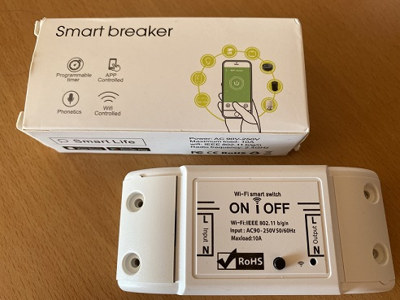

# Pythonista / IOS Automations - Using a Switch 
 
 

One of the values that we as programmers look for is the practicality in our life, whether in our personal or professional life we always look for improvements of our activities. One of the issues sought in the market that impact our personal lives is the **Smart house** or **Home Automation**, which consists of automating or monitoring our domestic tasks and environments using internet connectivity and integrated systems.
 
On IOS you can find systems and products integrated with Homekit and Shorcut Automations, both native to Iphone. Unfortunately Apples products tend to be more expensive on the market and for that reason, I tried to create alternatives to create automations with a lower price.

Uma das coisas que nós, programadores, buscamos é a praticidade em nossa vida, seja em nossa vida pessoal ou profissional sempre buscamos o aperfeiçoamento de nossas atividades. Um dos assuntos procurados no mercado que impactam nossa vida pessoal é a **Smart house** ou **Home Automation**, que consiste em automatizar ou monitorar nossas tarefas domésticas e  ambientes utilizando a conectividade com a internet e sistemas integradores.
 
No IOS você pode encontrar sistemas e produtos integrados com o Homekit e Automations, ambos nativos do Iphone. Infelizmente os produtos Apples tendem a serem mais caros no mercado e por isso, eu busquei criar alternativas para criar automações com um preço menor.

## The Switch

 
 

For this first attempt I used a Smart Breaker that I bought from one of these Chinese sites, where it is easily found. It can be used as a energy switch and easily installed. I did not want to change the electrical installation of my house (because I am renting) and instead I adapted a male and female socket as in the figure below, so I might reuse it when I want to change devices, but you can adapt it according to your need.

Para este primeira tentativa eu utilizei um Smart Breaker que comprei de um destes sites chineses,onde é facilmente encontrado. Ele é pode ser utilizado como um interruptor de energia e facilmente instalado. Eu não quis mudar a instalação elétrica da minha casa (pois estou alugando) e ao inves disso adaptei uma tomada macho e fêmea como na figura abaixo, assim posso reutiliza-lo quando quiser mudar de dispositivo, mas você pode adapta-lo de acordo com sua utilização.   

## Connection to Tuya and IOS

(to continue...)
