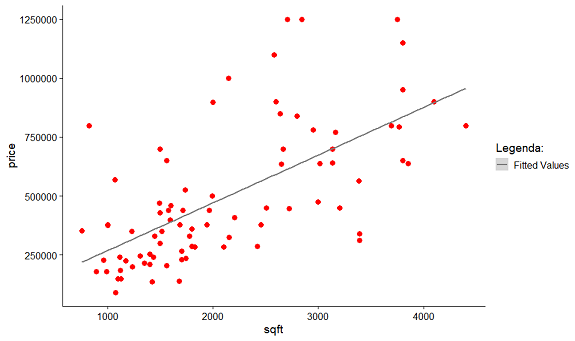

## What it is and how to use Linear Regression on R
<br />

<div class = "row">
<div class = "col-md-6">
**PT**: Se você nunca ouviu falar sobre o tema, **regressão linear é uma análise preditiva supervisionada**  usada para entender e explicar a relação entre uma variável dependente com variáveis independentes. Isso é, um modelo ou uma fórmula que explica o comportamento de uma variável Y dadas variáveis X que impactam a variável Y.
<br /><br />Digamos que queremos estudar o consumo de sorvete por dia em uma loja. Podemos usar o número de sorvetes comprados como nosso resultado, a variável dependente Y. Podemos usar o dia da semana, o clima e a temperatura para explicar esse consumo.
</div>
<div class = "col-md-6">
**EN**: If you never heard about it, a **linear regression is a supervisioned predictive analysis** used to understand and explain the relationship between a dependent variable with independent variables. This means it is a model or a formula that explain the behaviour of a variable Y given variables X that impacts the variable Y. 
<br />
<br />
Lets say that we want to study the consumption of ice cream given a day at one store. We could use the number of ice creams cones bought as our result , the Dependent variable Y. We could use the day of the week, the weather and temperature to explain this consumption.
<br />
</div>
</div>
<br />


<div class = "row">
<div class = "col-md-6">
**PT**: O modelo acima é uma regressão linear para explicar o número de casquinhas de sorvete vendidas Y em um dia, dadas as 3 variáveis independentes X1, X2 e X3 (dia da semana, clima e temperatura). Os A's são parâmetros (inclinações) que controlam o impacto das Variáveis independentes X e estarão presentes em nosso modelo.
<br />Você pode pensar que o o clima e o dia da semana não são variáveis numéricas reais e vocÊ está certo! Neste caso temos que trabalhar um pouco para transformá-los, falaremos sobre isso em outro post.
</div>
<div class = "col-md-6">
**EN**: The model above is a linear regression to explain the number of Ice Cream Cones sold Y on a given day with  3 independent variables X1, X2 and X3 (Weekday, Weather and Temperature). The A's are parameters (slopes) that controls the affect of the independent Variables X and they will appear on our model.
<br />Weather and Weekday are not actual numericals variables so we might have to work a little bit to transform it,  we will talk about it later on another post.

<br />
</div>
</div>
<br />


# House price Dataset


<div class = "row">
<div class = "col-md-6">
**PT**: Vamos usar outros **[dados](http://www.rossmanchance.com/iscam2/data/housing.txt)** para entrar em mais detalhes. Os dados abaixo são de preços de residências de **[Rossmanchance](http://www.rossmanchance.com/iscam2/)** , que contêm área; preço; cidade e números de quartos e banheiros de cada casa.
<br />Usando a função Summary ***summary(house)*** no R, podemos verificar mais informações dos dados:
</div>
<div class = "col-md-6">
**EN**: Lets use another **[dataset](http://www.rossmanchance.com/iscam2/data/housing.txt)** to get into details. The data we are going to use is a Housing prices dataset from **[Rossmanchance](http://www.rossmanchance.com/iscam2/)** , that contais values area; price; city and numbers of bedrooms and bathrooms from each house.
<br />Using a Summary function ***summary(house)***, we can see how the values are distribuited in the dataset:

<br />
</div>
</div>

```
house = read.table("http://www.rossmanchance.com/iscam2/data/housing.txt", header = T, sep = "\t")
summary(house)
```


<br />
<br />
<div class = "row">
<div class = "col-md-6">
**PT**: Você pode ver acima a distribuição das variáveis na base de dados. Note que City é uma variável categórica (classificável e não continua) ao contrário das outras que são do tipo continuas. Por enquanto, vamos apenas utilizar as variaveis contínuas.
<br /><br />  Criando um gráfico com os dados da base com exceção de Cidade, podemos ver uma tendência de aumento de valores com a variação dos metros quadrados das casas:
</div>
<div class = "col-md-6">
**EN**: You can see the distribution of variables in the database above. Note that City is a categorical variable (classifiable and non-continuous) unlike the others that are continuous. For now, let's just use  continuous variables.<br /> 
<br /> Plotting a chart with the base data excluding City, we can see a trend when increasing price values with the variation of square meters:

<br />
</div>
</div>

```
gg3 <- ggplot(house, aes(x=sqft, y=price)) + 
  geom_point(aes(col=bedrooms, size=baths)) + 
  geom_smooth(method="lm", se=F) + 
  labs(subtitle="House prices per Squarefoor area, n of baths and bedrooms", 
       y="Price", x="Square Foot",  title="Scatterplot", caption = "Source: house")
plot(gg3)
```


<br />
<br />
<div class = "row">
<div class = "col-md-6">
**PT**: A linha azul no gráfico acima já é um modelo linear usando Square foot. Você pode ver uma correlação entre Square foot e preço da casa. Vamos analisar essas correlações primeiro. 
<br />Construindo um gráfico de **[Correlação Pearson](https://www.statisticshowto.com/probability-and-statistics/correlation-coefficient-formula/)** como o gráfico abaixo, você pode ver as correlações entre as variáveis. Quanto mais largas as linhas que conectam as variáveis mais forte são suas correlações, o que significa que elas se relacionam entre si. Você pode ver uma forte correlação entre a variável sqft e preço mas não o mesmo comportamento entre preço e quartos / banheiro.
</div>
<div class = "col-md-6">
**EN**:  The blue line on the graph above is already a linear model using Square foot only and you can see a correlation between Square foot and House price. Lets analyze those correlations first.
<br />Plotting a **[Pearson correlation](https://www.statisticshowto.com/probability-and-statistics/correlation-coefficient-formula/)**  graph like the one below, you can see the correlations between variables. As larger  the lines connecting variables are , stronger their correlation, meaning that they relate to each other. You can see a strong correlation between the variable sqft and price, but not the same behavior between price and bedrooms/bath.

<br />
</div>
</div>
<br />


```
house %>%
  correlation(method = "pearson") %>%
  plot()
```


<br />
# The Model

```
model_houses <- lm(formula = price ~ . - City,data = house)
```
<div class = "row">
<div class = "col-md-6">
**PT**:  O código acima é o que necessitamos para criar nosso modelo. Vamos criar um modelo linear, com a variável  ***price *** como resultado (Variável dependente Y) e utilizando todas as variáveis da base com exceção de ***City***, que é categórica.<br /> Podemos utilizar a função  ***summary(model_houses) *** para entender mais detalhes deste modelo:
</div>
<div class = "col-md-6">
**EN**:  The code above is what we need to create our model. We are creating a linear model with the variable ***price *** as result (Independent variable Y) and using all the variables in the base except ***City***, which is categorical.<br /> We can use the function ***summary(model_houses)*** to understand  this model:
</div>
</div>


<div class = "row">
<div class = "col-md-6">
**PT**:   Há muitas informações na imagem acima. Vamos examiná-las:
<br />***Call***: são as variáveis em nosso modelo.
<br />***Residuals*** é a diferença entre os dados observados (os dados que consumimos) e os dados previstos (o resultado do nosso modelo aplicado aos mesmos dados).
<br />***Coefficients*** nos dizem o quanto as variáveis independentes X explicam o comportamento de nossa variável independente Y - preço.
<br />***Significance code*** nos informa sobre o valor p e como o modelo explica o comportamento de nossa variável independente Y - price
<br />Existem algumas outras informações no final que requerem um pouco mais de conhecimento aprofundado, o que deixaremos para outro post.
</div>
<div class = "col-md-6">
**EN**:  There is a bunch of information on the image above. Lets go over them:
<br />***Call:*** are the variables on our model.
<br /> ***Residuals***  is the difference between the the observed data (the data we used) and the the predicted data (the result of our model applied to the same data).
<br />***Coefficients*** tell us how much the independent variables X explain the behavior of our independent variable Y - price.
<br /> ***Significance code*** tell us about the p-value and how the model explain the behavior of our independent variable Y - price.
<br /> There is some other information on the bottom that require a little bit more deep information, we will let that for another post.
</div>
</div>
<br /><br />
<div class = "row">
<div class = "col-md-6">
**PT**:  Usando as informações acima, os Coeficientes estimados seriam as variáveis As em nosso modelo, aquelas da primeira imagem em nosso modelo de casquinha de sorvete. Isso significa que nosso modelo é on our model, the ones for the first picture on our ice cream cone model. That means that our model is **Y(price) = 146817.28 + 221.38 * sqft -52862.71 * bedrooms +27600.71 * baths**. Isso significa que cada sqft acrescenta $ 221,38 no preço da variável Y dependente, bem como - $ 52,862 para cada quarto e $ 27,600 para cada banheiro.<br />
Mas há uma coisa que devemos verificar antes de usar esta fórmula: o valor p (ou Pr) para cada coeficiente. O valor p é o resultado de um teste de hipóteses que nos diz que quanto mais baixo fica, mais forte é a evidência do impacto daquela variável no comportamento de Y. Isso significa que, por mais baixo que seja, melhor para o nosso modelo. Normalmente consideramos 5% (0,05) como um bom seletor de variáveis boas e más. Você pode ver que apenas ***sqft*** tem um valor abaixo de 0,05, portanto, devemos usar apenas esta variável para este modelo. 
</div>
<div class = "col-md-6">
**EN**: Using the information above, the ***Estimated Coefficients*** would be the As variables on our model, the ones for the first picture on our ice cream cone model. That means that our model is **Y(price) = 146817.28 + 221.38 * sqft -52862.71 * bedrooms +27600.71 * baths**.  That means that every ***sqft*** adds $221.38 on the depende variable ***Y price*** , as well as -$52.862 for every ***bedroom*** and $27.600 for each ***bath***. 
<br />But there is one thing we should check before using this formula: the p-value (or Pr) for every coefficient. The p-value is the result of a hypothesizes test that tell us that as lower it gets, stronger is the evidence of the impact of that variable on the Y behavior. That means that as lowest it is, best for our model. We usually consider 5% (0.05) as a good selector of good and bad variables. You can see that only ***sqft*** has a value under 0.05, so we should use only this one variable for this model.
</div>
</div>

<br />
# The Model 2


<div class = "row">
<div class = "col-md-6">
**PT**: E finalmente usando apenas ***sqft*** em nosso modelo, vamos ter o seguinte resultado:
</div>
<div class = "col-md-6">
**EN**: And finally, using just ***sqft*** as the variable for our model, we will have the result below: 
</div>
</div>

```
model_houses2 <- lm(formula = price ~ sqft,
                   data = house)

house$price2 <- model_houses2$fitted.values

my_plot <- 
  ggplot(house, aes(x = sqft, y = price)) +
  geom_point(aes(x = sqft, y = price) ,color = "red", size = 3) +
  geom_smooth(aes(color = "Fitted Values" , x = sqft, y = price2)) +
  labs(x = "sqft", y = "price") +
  scale_color_manual("Legenda:",values = "grey50") +
  theme_cowplot()
my_plot
```



